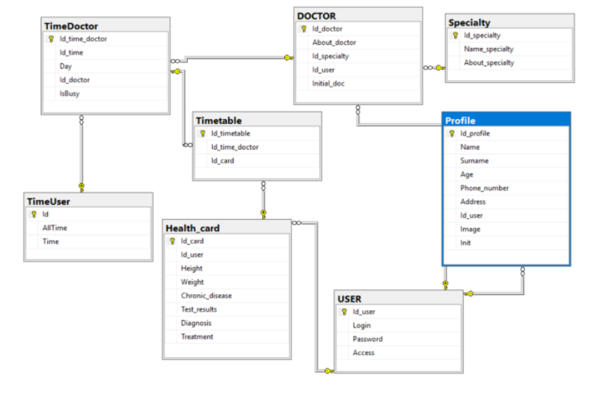

## Clinic

  The   Clinic software tool realizes the work with the patient's medical card, the patient's appointment to the doctor, the list of the doctor's patients, the work with the doctor's profile.
To create, store and manage data, the relational DBMS `Microsoft SQL Server 2017` was used. For the front-end was used `XAML`. The `C#` language was used for interaction between the front-end and the stored procedures SQL.

There are 8 tables in the database. Two access levels have been created: patient and doctor.

 The file ["KURSOBOI_CLINIC.sql"](Clinic_v2/KURSOBOI_CLINIC.sql) contains scripts using a group of DDL operators creating tables in the database.
 
 The ["Working.sql"](Clinic_v2/Working.sql) file contains scripts to populate tables with basic information.
 
 The ["Procedure.sql"](Clinic_v2/Procedure.sql) file contains stored procedures using the DML and TCL operator groups. The file is designed to manipulate data in tables and restrict user access to them. There are procedures for technology full text searches.
 
 The ["xml.sql"](Clinic_v2/xml.sql) file implements the procedures for exporting and importing data from the xml file into the "USER" database table and vice versa.
 
 The ["Productivity.sql"](Clinic_v2/Productivity.sql) file contains queries to test the performance of the database. A non-clustered index has been created for the high-loaded USER table to improve performance.
 
 The ["inform.txt"](Clinic_v2/inform.txt) file contains logins and passwords of already created users.
